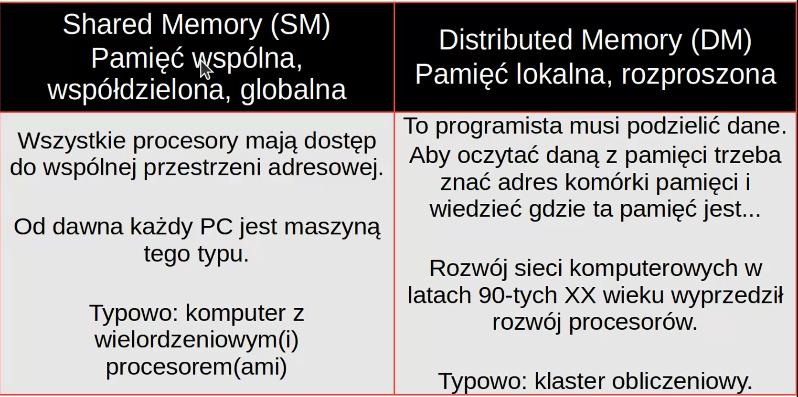

# Programowanie Rozproszone i równoległe

Egzamin stacjonarny jak zwykle. Wielokrotny wybór, ujemne punkty, można omijać pytania.

## Wykład 1

Część związana z projektami zaliczeniowymi
---------------------------------

- Wstęp/historia
- IPC
- MPI
- Java
- RMI
- OpenMP
- Optymalizacja Kodu

----------------------------------
Na cześć wykładu
----------------------------------

- CUDA
- REST
- (g)RPC
- XML + SOAP

-----------------------------------

Strona Oramusa: 

Logowanie: PRiR / @FAIS

Liczymy równolegle, bo czasami inaczej sie nie da:

Podagoda(X, Y, Z) -> temperatura, ciśnienie, wilgotność, kierunek wiatru; Siatka nad Polską z komórek elementarnych; Złożoność obliczeniowa; Sumulacja 4 dni z krokiem czasowym 5 min; Do wykonania w chuj operacji zmiennoprzecinkowych; Jeden CPU wykona taką operacje w 10 dni.

Program sekwencyjny składa się z jednego ciągu instrukcji. Przekształcają one dane wejściowe w wyjściowe. Program taki uruchamiany jako proces sekwencyjny i wykonywany jest przez jeden wirtualny, umowny procesor.

W programie sekwencyjnym operacje wykonywane są kolejno po sobie. Musimy poczekać na zakończenie operacji poprzedniej zanim zaczniemy następny.

Ze współbieżnością mamy do czynienia, gdy dwie lub więcej czynności mogą dziać w tym samym czasie. Dwie operacje są współbieżne, gdy w trakcie trwania jednej rozpoczęto drugą.

Program współbieżny to taki, w którym problem potrafimy podzielić i realizować w postaci wielu zadań, które mogą być realizowane współbieżnie.

Generalnie, w programie wpsółbieżnym nie sposób ustalić kiedy operacje należące do różnych zadań będą wykonane. Nie wiadomo, któa operacja jednego zadania poprzedzi rozpoczęcie realizacji operacji z innego zadania. Procesy współbieżne działają asynchronicznie. Można synchronizawać ale to kosztuje!

Synchronizacja wykonania programu współbieżnego oznacza jakąś formę komunikacji pomiędzy zadaniami. Tracimy wtedy czas procesora.

Program współbieżny - procesy mogą być wykonywane w tym samym czasie. Dodatkowo program ten musi rozwiązać problemu synchronizacji i komunikacji pomiędzy procesami. Wynik działania powinien być taki sam jak dla programu sekwencyjnego.

Program równoległy - program współbieżny plus zasoby sprzętowe, które umożliwiają równoległe (jednoczesne) wykonywanie procesów współbieżnych

Program rozproszony - program współbieżny, który używa zasobów wielu komputerów, czyli procesory są w tym przypadku rozproszone.

Przeplot rozwiązuje problem braku zasobów, ale sam z siebie generuje dodatkowe koszty związane z przełączeniem kontekstu.

Aby zminimalizować liczbę przełączeń kontekstu systemy operacyjne przeplot wykonują co pewien czas. Procesy otrzymują dostęp do procesora na pewien czas. W trakcie trwania jednego takieo okresu, proces wykonuje wiele operacji. System operacyjny musi szeregować zadania różnych programów, obsługiwać przerwanai i uwzględniać priorytety procesów.

Proces to działający program. Proces otrzymuje od systemu operacyjnego zasoby: pamięć uchwyty do plików, gniazda sieciowe...

Instrukcje procesu wykonuje co najmniej jeden wątek. Wątki procesu mają dostęp do zasobów procesu.

Maszyny typu Multiple Instruction Multiple Data (MIMD)


Są jeszcze rozproszone maszyny z pamięcią wspólną. Rozwiązania sprzętowe lub programowe.

Hierarchiczna Pamięć Współbieżna - czas dostępu do pamięci zależy od lokalizacji pamięci.

__Wnioski__:

1. Przetwarzamy równolegle, bo czasami inaczej sie nie da
2. To co robił jeden procesor - ma teraz robić ich wiele - ale to oznacza konieczność wymiany informacji, a to z kolei trwa. W sumie, w przypadku równoległym potrzeba większej mocy obliczeniowej niż w przypadku sekwencyjnym aby "odrobić" czas zajmowany na komunikację.

__Równoległość procesowa__ - wykonywanie niezależnych zadań z kolejki przez wiele procesorów

__Równmoległość tablicowa__ - Musztra wojskowa

__Równoległość potokowa__ - taśma produkcyjna, budowa i zespoły pracowników

__Przetwarzanie rozproszone__ - dziedzina wiedzy o systemach zawierających więcej niż jeden element przetwarzający, element przechowujący, proces współbieżny lub działający program, które są ściśle lub luźno ze sobą związane

__System równoległy__ - to ściśle powiązany system rozproszony.

W przetwarzaniu równoległym zasoby systemu są podporządkowane celowi w postaci rozwiązania jednego problemu

System rozproszony może pracować nad kilkoma problemami równocześnie.

System rozproszony -> sieć telefoniczna </br>
System równoległy -> orkiestra

__Poprawność programu współbieżnego__ = poprawność programu sekwencyjnego + bezpieczeństwo + żywotoność

<p align="center">
{p}S{q}
</p>

Poprawność częściowe - każde kończące się wykonanie programu S z danymi zgodnymi z p prowadzi do danych spełniających q.

Warunek stopu - każde wykonanie programu S dla dowolnych danych zgodnych z p, się kończy. Generalnie, trzeba udowodnić, że iteracje w programie się skończą

Poprawność pełna - poprawność częściowa + warunek stopu

Program współbieżny składa się z zadań, które realizowane są sekwencyjnie .Każde z zadań musi być w pełni poprawne

Zadania się ze sobą komunikują. Komunikacja nigdy nie może złamać warunków dotyczących bezpieczeństwa. Jednocześnie, dowolne wykonanie współbieżnych zadań musi "w końcu" doprowadzić do spełnienia warunków żywotności.

Bezpieczeństwo chroni przed czymś złym, Żywotność obiecuje, że stanie się coś dobrego.

Aby zagwarantować bezpieczeństwo aplikacji współbieżnej, działającej na amszynie z pamięcią wspólną, muszą istnieć mechanizmy wzajemnego wykluczania się zadań w dostępie do zasobów - zmienna, plik, terminal, połączenie sieciowe

Wykluczanie oznacza, że danego zasobu może jednocześnie używać tylko jedno zadanie. Sekcja krytyczna to fragment zadania, w którym używamy problematycznego zasobu(ów). __Tylko jedno zadanie może realizować sekcję krytyczną__.

Typowe narzędzie chroniące - Semafor - __typowe przykłady sam przerób__

Nieumiejętne stosowanie sekcji krytycznych może doprowadzić do problemów z programem wpsółbieżnym:

- __Blokada__ - zadanie zostało wstrzymane, ale nigdy nie obudzone, czyli się nie zakończy.
- __Zakleszczenie__ - blokada, która jest wynikiem tego, że zadanie, które może inne obudzić, samo zostało wstrzymane. Zakleszczenie to blokada wielu zadań.
- __Zagłodzenie__ - brak dostępu do wymaganego zasobu. Generalnie, zasób jest wprawdzie przydzielany, ale polityka przydziału nie wgarantuje, że każdemu z zadań dostęp ostatecznie zostanie przyznany.

Aby zadanie doczekało się szczęśliwie dostępui do wymaganego zasobu potrzebna jest uczciwość w zarządzaniu dostępem. 

Uczciwość słaba: proces, który niepezerwanie zgłasza żądanie zostanie kiedyś obsłużony

Uczciwość silna: proces, który nieskończenie wiele razy zgłasza żądanie zostanie kiedyś obsłużony.

Różnica jest subtelna. Niech przykładowe zadanie zgłasza żądanie dostępu, ale zamiast się zatrzymać w przypadku odmowy, podejmuje inne działania. W przypadku uczciwości słabej nawet nieskończona liczba powtórzeń takiego działania nie gwarantuje, że zadanie otrzyma dostęp.

Monitor to konstrukcja wyższego poziomu od semafora. Gwarantuje wzajemne wykluczanie. Dodatkowo monitor posiada zmienne warunków, na których operuje się za pomocą:

- wait(a) - wstrzymuje proces, który wykonał procedurę monitora i odblokowuje monitor. Proces trafia do kolejki związanej z warunkiem a, którzy jeszcze nie nastąpił i to spowodowało wykonanie wait.
- signal(a) - inny proces tą operacją uwalnia proces z kolejki powiązanej z warunkiem a. Operacja signal wywoływana jest gdy warunek jest już spełniony. Uwolniony proces nie może rozpocząć pracy tak długo jak inny proces jest wciąż aktywny wewnątrz monitora.

S(n,P) = T(n,1)/T(n,P) > P

Slajd 46/47/48/49 - przepisać wzory

__Wnioski__:

3. Zwiększenie udziału kodu równoległego oznacza często zmianę algorytmu
4. Nie ma ucieczki przed przetwarzaniem równoległym
5. Istnieje wiele technologii, ale efektywne ich użycie wymaga zasosowania odpowiedniego sposobu

Dlaczego producenci sprzedają nam procesory z wieloma rdzeniami zamiast szybkich jednostek o jednym rdzeniu?

P = C f V^2 - Maksymalizacja Wydajności

## Wykład 2

Procesy i komunikacja międzyprocesorowa (IPC)

Programowanie równoległe w systemie z pamięcią wspólną:

Potrzeby programistyczne: tworzenie/ niszczenie / identyfikacji wątków / procesów, mechanizmy kontroli dostępu do danych (sekcje krytyczne)

Za zarządzaniem procesami odpowiada jądro systemu operacyjnego, sposób ich obsługi jest różny dla różnych systemów operacyjnych. W systemie operacyjnym każdy proces posiada proces nadrzędny, z kolei każdy proces może

Przkezywanie informacji pomiędzy procesami działającymi na tym samym komputerze

Kolejka komunikatów - mechanizm komunikacji międzyprocesowej umożliwiający wymianę informacji pomiędzy procesami za pomocą kolejki.

Kolejka komunikatów jest asynchronicznym protokołem komunikacyjnym, co oznacza, że odbiorca i nadawca wiadomości nie muszą łączyć się z kolejką w tym samym czasie. Komunikaty przesłane kolejce są przechowywane aż do czasu odebrania przez inny proces.

Key - identyfikator unikalny w skali całego systemu. Procesy, które chcą współużytkować jedną kolejkę komunikatów muszą podać tą samą wartość. `ftok()` - tożsamość plikuo nazwie podanej w pathname oraz 8 najmniej znaczących bitów proj_id do wygenerowania klucza komunikacji międzyprocesowej Systemu V.

Wartość wynikowa jest taka sama dla wszystkich ścieżek stanowiących nazwy tego samego pliku, o ile użyje się tej samej wartości proj_id

Konieczna jest konsekwencja. Jeśli dostęp do danych ma być bezpieczny, to wszędzie w kodzie musi być zabezpieczony

## Wykład 3

Skalowanie poziome (scale-out) - Dodajemy kolejny komputer

Nie dość, że sama komunikacja między procesami w obrębie jednego komputera jest problematyczna, to teraz dochodzi jeszcze obsługa komunikacji za pomocą sieci

Programowanie równoległe w systemie z pamięcią lokalną!

Zadania są wykonywane na maszynach posiadających własną przestrzeń adresową

Potrzeby programistyczne:

- tworzenie/niszczenie procesów
- identyfikacja procesów - aplikacje są często typu SPMD
- komunikacja pomiędzy procesami (a)synchroniczna (nie)blokująca

Nie ma potrzeby stosowania niektórych rozwiązań koniecznych do programowania maszyn ze współdzieloną pamięcią!

Klastry komputerowe jak narzędzie ogólnego przeznaczenia:

Zalety:

- Awaria węzła nie wyłącza całej maszyny
- Łatwa/tania rozbudowa
- Możliwość łączenia sprzętu różnych dostawców
- Możliwość łączenia różnego rodzaju węzłów (CPU/GPU/FPGA)

Wady:

- Ograniczona wydajność obliczeniowa podejynczego węzła
- Mało pamięci na jednym węźle (typowo 2-4GB/rdzeń)
- Ograniczenia wynikające z szybkości stosowanej sieci połączeniowej

Linda zapewnia pojedynczą, logiczną pamięć dzieloną dla wszystkich procesów w systemie. Każdy proces widzi tę samą przestrzń danych i może pisać lub czytać dane, które są współdzielone przez wsyztskie procesy.

Gniazda - komunikacja z tworzeniem połączania i bezpołączenia.

Zalety:

- Prosty i efektywny sposób transmisji
- Niemal identyczna implementacja w różnych systemach

Wady:

- Serwer przywiązany do stałego portu
- Ograniczenie uprawnienia użytkownika
- Dane przesyłane w formacie binarnym
- Różncie w bibliotekach

__Message Passing Interface (MPI)__ - standard interfejsu przesyłania komunikatów i synchronizacji zadań działających w rzeczywistych lub wirtualnych systemach równoległych.

Zalety:

- darmowy, public domain
- efektywny
- dobra dokumentacja
- programista nie musi wiedzieć jak dokonuje się komunikacja, wystarczy, że wie jak ją zlecić
- komunikacja punkt-punkt i grupowa
- rozwiązuje problem ujednolicenia reprezentacji danych

Wady:

- procesy a nie wątki, czyli brak możliwości użycia pamięci współdzielonej, ale jeśli ktoś dobrze wie jak z MPI korzystać to może stworzyć bardzo wydajny kod nawet dla systemów SMP.

W MPI grupa procesów, które mogą się wzajemnie komunikować oraz pewien kontekst to komunikator. Może być wiele komunikatorów, dla każdego komunikatora każdy proces może być jednoznacznie zidentyfikowany. Transmisja nie musi objąć wszystkich.

MPI - wymiana komunikatów

Z punktu widzenia użytkownika podstawową informacją jest ta, czy wolno mu używać bufora zaraz po zakończeniu funkcji wysyłającej dane. Czyli, czy funkcja wysyłająca dane zakończy się przed wysłaniem wszystkich danych. Ze względu na konieczność synchonizacji pracy programu ważne jest także czy odbierający już dane odbiera.

Tryby komunikacji:

- standard - MPI decyduje, czy wychodząca wiadomość zostanie zbuforowana u nadawcy. Wykonanie funkcji może się zacząć choć odbiorca nie wywołał funkcji odbierającej dane a zakończyć przed wywołaniem funkcji odbierającej dane lub dopiero po dostarczeniu danych
- buffered(B) - można zacząć i zakończyć operację choć odbiorca nie wywołał funkcji odbioru. local - o zakończeniu nei decyduje wywołanie funkcji odbioru. Obszaru pamięci przeznaczony na bufory jest w gesti programisty.
- synchronous(S) - można zacząć przed wywołaniem funkcji odbioru, zakończyć tylko gdy dane zaczęto już przekazywać. Dostarcza wiedzy o tym, w którym miejsci algorytmu jest odbierający dane
- ready(R) - można zacząć tylko gdy odbiorca jest już gotowy na odbiór danych.

## Wykład 4

Wątki stanowią podstawową cechę platformy Java. Z punktu widzenia użytkownika jego aplikacja realizowana jest przed jeden wątek, ale sama JVM używa wielu wątków. Podstawowy wątek aplikacji użytkownika Java to "mian thread".

JVM to pojedynczy proces, choć nasz program może uruchamiać kolejne procesy:
```java
public Process exec(String[] cmdarray)
```

Należy utworzyć obiekt klasy `java.lang.Thread` i użyć metody start().

Kod, który wykonywany jest jako osobny wątek znajduje się w publicznej chuj chuj

Kończenie pracy wątków. `void stop()` zostało uznane za niebezpieczne i przestarzałe. Programowanie rozproszone i równoległe – wykł.
