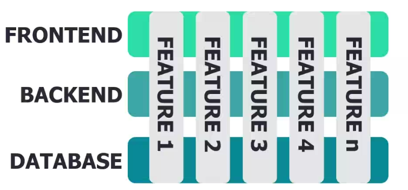

# Zarządzanie Projektami

Mail Marcina Gomoły - u.m.gomola@gmail.com

1. Podstawowe narzędzia, Diagram Grantta, Od pomysłu do realizacji, Cykl życia projektu, Vertical vs Horizontal slice
2. Waterfall, Agile i Lean, Ogólnie o metodologiach zwinnych, SCRUM, KANBAN, XP, Organizacja projektu w metodologii SCRUM, Ceremowanie SCRUM, Estymacje
3. Struktura zespołu IT, Pozyskiwanie Funduszy, Projektowanie MS (Milestone) Planu, Zarządzanie rynkiem, Konferencje
4. Zaliczenie

#### Projekt

- Pomysł na innowacyjną aplikację(dowolną) lub grę komputerową w postaci 1-pagera zawierającego:
    - Informacje o obecnym zespole
    - Krtótkim podsumowaniu projektu i jego USP
    - Informacje o Targecie projektu
    - Informacje o modelu biznesowym
    - Zagrożeniach i konkurencji

- Wysokopoziomowy plan projektu w oparciu o diagram Grantta, zawierający informacje o fazach proejektu / milestonach

- Przykładowy niskopoziomowy Backlog projektu, przypadający na środkowy etap produkcji wraz z opisami: stories, taskami, informacjami o działach, estymacjami w Story Point'ach, priorytetach
- W oparciu o backlog oraz założone wcześniej velocity poszczególnychg działów zaplanowanie jednego 2-tygodniowego sprintu

#### Egzamin

Pisemny egzamin końcowy - Warunkiem zaliczenia modułu jest uzyskanie oceny pozytywnej z egzaminu. Zakres materiału obejmuje zagadnienia z wykładu (teoria).

## Wykład 1

Zarządzanie projektami to proces planowania, realizacji i nadzorowania działań, które prowadzą do osiągnięcia określonych celów. __W praktyce__ - Chaos, ogień i This is Fine.

Wykres Granta

1. Wykres Grantta to narzędzie do wizualnego planowania i zarządzania projektami, któe przedstawia zadania w dormie poziomych pasków na osi czasu. Umożliwia śledzenie postępu projektu, harmonogramu zadań oraz zależności między nimi w jednym, przejrzystym diagramie.

2. Grantt Granttowi nie równy - Zależy jak go wykorzystujemy; można próbować śledzić za jego pomocą postępy wysoko-poziomowe jak i nisko-poziomowe.
3. W praktyce bywa z nimi różnie

__Podstawy projektowe - pierwsze kroki:__
-   Pomysł
-   USP (Unique selling proposition) - element albo jeszcze lepiej szereg elementów unikalnych - w naszym przypadku - na tle aplikacji konkurencyjnych dostępnych na rynku.
-   Analiza Rynku
    -   Research Targetu - Dla kogo jest ten produkt?
    -   Research Konkurencji - Analiza tytułów pokrewnych
    -   Draft GDO/ 1-Pager - Krótki dokument zawierający podstawowe informacje o produkcie
    -   Draft MS Planu - Opracowanie wstępnego MS planu i strategii produkcji; ile potrzeba czasu, jak projekt będzie tworzony, a może: Early Access?
    -   Draft Staffing Planu - Kto faktycznie będzie ten projekt robił
    -   Iteracja!
-   Planowanie
-   Pitchowanie - Krótka, zwięzła prezentacja pomysłu lub projektu, która trwa zwykle 15-30 min. Ma na celu szybko i skutecznie zaiteresować odbiorcę oraz przekazać kluczowe informacje o projekcie. A jeśli się nie uda? Kosz i Iteracja.

__Mamy Fundusze, co dalej?__ - Cykl życia projektu

-   Pre-produckja - Od startu projektu skupiamy się na budowie prototypu: sprawdzeniu koncepcji, zwykle w małym, doświadczonym zespole
-   Produkcja - Po Verticalu zwykle następuje rozwój zespołu i zaczyna się pełna produkcja nad featurami
-   Praca w Alfie - W teorii mamy już podwaliny projektu, natomiast praca wcale nie zamiera
-   Praca w Becie - Powinniśmy być skupieni na debugu i optymalizacji projektu, w praktyce zależy
-   Końcówka - Kluczowy moment w cyklu życia projektu. Przygotowanie do releasu

__Kluczowe Milesotny__
1. PoC - Pierwszy prototyp, zawierający kluczowe mechaniki, bardzo często barcdziej 'mock-up'y'
2. First Playable - Już więcej niż PoC, ale jeszcze nie Vertical Slice
3. Vertical Slice - "Demo" na potrzeby produkcji, wewnętrzny prototyp o niepełnej funkcjonalności ale prezentujący docelową wizję i jakość
4. Alpha - Pierwsza kompletna wersja produkcji
5. Beta - Kompletna wersja produktu, tylko usuwanie błędów
6. Gold Master - Opracowanie 

__Vertical Slice vs Horizontal Slice__

Vertical - 

Horizontal - Jeden Feature na jeden End-line

## Wykład 2

__Metodyki zarządzania__

__Waterfall:__
-   Metodologie klasyczne
-   Bardzo problematyczne, obecnoe rzadko stosowane ew. na małą skale produkcyjną
-   Albo z powodu prawidłowego zarządzania projektami

Proces może się zacząć jeżeli poprzedni się zakończył (ex. Wymagania->Projekt->Implementacja->Walidacja->Maintenance).

Zakładamy że zawsze jak proces sie kończy to jest wszystko w porządku - a w większości przypadków tak nie jest.

__LEAN:__
-   W oparciu o Lean management, opracowane i wdrożone w Toyocie
-   Podejście systemowe
-   Wprowadzenie "Pull" vs "Push"
-   Siedem zasad Lean:
    -   Eliminate waste
    -   Build quality in
    -   Create knowledge
    -   Defer commitment
    -   Deliver fast
    -   Respect people
    -   Optimize the whole

__Agile:__
-   Loop między Ownerem, zespołem i klientem - nastawiony na szybkie iteracje

__Frameworki procesowe__

__XP__:
-   Małe i średnie "ryzykowne" projekty
-   Przyrost iteracyjny
-   Unit testy
-   Refaktoryzacja
-   Kontakt z klientem
-   Pair programming

__Kanban__:
-   Agile Coach
-   Proces jest ciągły, nie ma sprintów
-   Backlogu jedynie projektu
-   Kanban board z capacity zespołu
-   Pull z kolumny do kolumny gdy jest wolne capacity
-   Bardzo dobre np. dla artystów

__Scrum__:
-   SCRUM Master
-   Backlog projektu i sprintu
-   Jeden pull na sprint
-   Nie powinny się pojawiać nowe stories midsprint
-   Kanban board
-   Milestony

__Role Projektowo-procesowe__

Scrum Master - Strażnik procesu; Odpowiedzialny za "niski poziom" procesu, wspomaganie zespołu podczas ceremonii, usuwanie wszelkich przeszkód procesowych

Project Owner - Vision Holder, właściciel produktu; odpowiada za kształt projektu i kierunek developmentu

Project Manager - Właściciel procesu, bardziej wysokopoziomowy, nie odpowiada za kształt projektu tylko po to aby projekt był ukończony

Proces jest dla procesu - Dobrze zaimplemetowany SCRUM jest w pierwszej kolejności narzędziem dla developerów, aby skutecznie implementować zadania, w drugiej narzędziem informacyjntym dla managementu, aby mogli nadzorować projekt i odpowiednio reagować .Nie jest "biczem" na developerów

Samoorganizujący się zespół - Zespół sam decyduje które co zostanie wykonane w konkretnym sprincie, sam określa zakres poszczególnych zadań. sam estymuje czas, jaki jest potrzebny na to, aby zadanie zostało wykonane

Niewielki i interdyscyplinarny zespół - Zespóły SCRUMowe powinny być niewielkie. Dązymy do tego aby w każdym sprincie efektem była wartość dodana do projektu

__Ceremonie SCRUMowe__:

PO & PM Meeting - spotkanie tworzące USER STORIES, określają wszystkie rzeczy nad którymi musimy pracować

Sprint Planning - Spotkanie całego SCRUM Teamu, mające na celu ustalenie co będzie produkowane w najbliższym sprincie

Retrospective - Spotkanie całego zespołu, na którym podsumowywane są wszelkie dobre i złe wydarzenia w procesie

Backlog Refinement - Spotkanie na którym zespół analizuje backlog - nowe i stare Stories i Taski, dokonuje stymacji, rozbicia etc.

Sprint Review - Duże spotkanie pod koniec sprintu, na którym PO odbiera owoce pracy całego zespołu w okresie Sprintu

Daily - Codzienne krótkie spotkanie na którym się raportuje update'y, jakiś problem itd.

__Estymacje__

Jak?:
-   Roboczodni, Roboczogodziny
-   Story Points System: złożoność, czasochłonność, zagrożenia
-   Dlaczego punkty?

Co dalej?:
-   Refinement i wycena, SCRUM POKER
-   Możliwość produkcyjne zespołu
-   Project Backlog -> Sprint Backlog w zależności od capacity zespołu

Zagrożenia:
-   Estymacja jest trudna, zawsze
-   Planowanie życzeniowe
-   SCRUM Poker wydłuża znacząco czas refinementu, zwłaszcza w większych zespołach
-   Produkt trzeba dowieźć, system punktowy nie może przeszkadzać

At the End - To tylko narzędzia!

__A praktyka?__
-   Długości sprintów i siatka 2x2x1
-   Refinement poza ceremoniami
-   Pipeline designu
-   Pipeline komunikacji
-   Filmy prezentacyjne
-   Balans w ceremoniach
-   Warto ułożyć wszystko przed skalowaniem zespołu
-   Agile niech będzie zwinny!

## Wykład 3

__Struktura Zespołów__

__Head Działu__ - Wytycza kierunek swojego działu, projektuje procesy i odpowiada za cały kształt i podległej części projektów

__Lead działu__ - Stanowisko o kompetencjach tak produkcyjnych jak i zarządzających; jest odpowiedzialny za produkcję i wspomaganie zespołu w codziennych problemach

__Junior__ - małe doświadcz3enie i umiejętności, wymaga prowadzenia

__Senior__ - Duże doświadczenie w swojej dziedzinie, wieloletni staż pracy

Stanowisko a odpowiedzialność - Rozwój w hierarchii zespołu, to nie tylko doświadczenie w aspekcie technicznym ale i kompetencje miękkie. Nawet Senior poza produkcją, cżeso delegowany jest do pomocy/mentoringu młodszym stażem pracowników.

W związku z tym, seniorzy, leadzi i headzi są odpowiedzialni za pracę działu, atmosferę i kolejno ponoszą odpowiedzialność w razie problemów produkcyjnych.

__Zespoły interdyscyplinarne__

__Code Team__ - Programiści silnika, gameplay'u

__Art Team__ - Art Director, koncept artyści, graficy 3D

__QA Team__ - Gameplay Testing, Compliance testing, Destructive tests

__Creative Director__ - Project Owner, główny designer

__Producer__ - Nadzór projektowy, zagadnienia związane z budżetem projektowym

__Design Team__ - Game Design, Level Design

__Biznesplan 101__ - Mówiliśmy trochę o pithowaniu projektów. Czasem warto jednak wcześniej/równocześnie zacząć myśleć o założeniu działalności.

Elementy Biznespalnu - Streszczenie, charakterystyka firmy, produkty, Struktura firmy, Analizy rybku, Marketing, Finanse

Skąd wziąć finansowanie? Niestety, nie ma drogi idealnej. Darmowe pięniądze nigdy nie są darmowe... co nie znaczy, że nie warto z nich korzystać

Środki własne, kredyty, dotacje, crowd-funcding, aniołowie biznesu, inne

Gdzie szukać? Konferencje - PAX East, GDC, Digital Dragons, gamescom

Milestone plan:

- To jest ważny dokument
- Operajmy się na danych
- Narzędzie jest nieważne
- Nowe życie Gantta
- Waterfall vs Agile
- Bufory na buforach

Business is business... ale pieniądze to nie wszystko. Plan to podstawa, metodyki są by pomóc - USP
